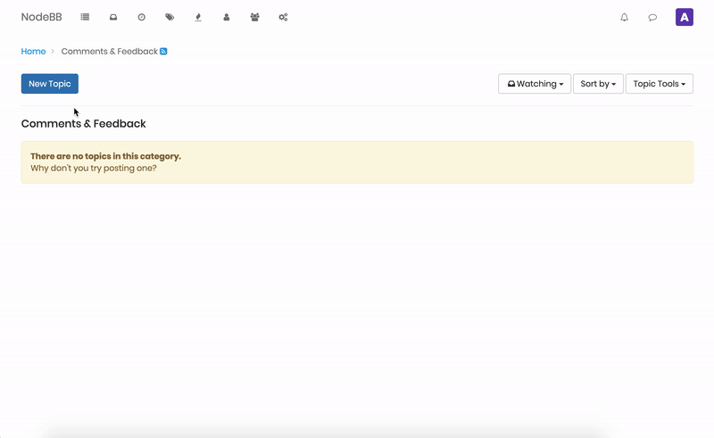
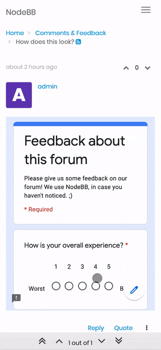

# NodeBB Plugin Google Forms

This NodeBB plugin allows embedding Google Forms in forum posts. 📝

<p>
    
    
</p>

## Installation

```
npm install madhavarshney/nodebb-plugin-google-forms
```

## Usage

When creating a post, paste the URL of the Google Form. This plugin will embed the Google Form and handle the rest! 🎉

Compatability: NodeBB v1.0.0+

Tested on: NodeBB v1.10.1, v1.13.3

## Contributing

All contributions are welcome! Please open an issue or PR if you have any ideas or suggestions.

## License

This plugin was originally written by @tailot. The source code in this repo is licensed under the MIT license.
